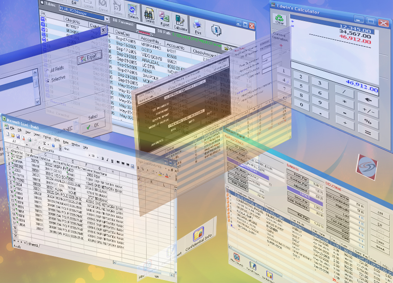



## Payroll system

### Description

Payroll System: (Updated 7/30/2008) This time in universal format, you may edit deduction of employee depend

on the company required deduction. Note: this is unfinished project, your good comment

and suggestion is highly appreciated, Or you may send errorlog.text to cyber_edu2005@yahoo.com

for my reference and modification.

p.s. you may download myactiveX here at psc sorry for the inconveniece, this system is still on going ... happy coding... dont forget to vote. references and others will be explained later watch out for the win help file (soon)...
 
### More Info
 

             |
---                |---
**Submitted On**   |2008-07-03 05:59:52
**By**             |[EDWIN O\. DELOS SANTOS](https://github.com/Planet-Source-Code/PSCIndex/blob/master/ByAuthor/edwin-o-delos-santos.md)
**Level**          |Intermediate
**User Rating**    |3.6 (18 globes from 5 users)
**Compatibility**  |VB 6\.0
**Category**       |[Databases/ Data Access/ DAO/ ADO](https://github.com/Planet-Source-Code/PSCIndex/blob/master/ByCategory/databases-data-access-dao-ado__1-6.md)
**World**          |[Visual Basic](https://github.com/Planet-Source-Code/PSCIndex/blob/master/ByWorld/visual-basic.md)
**Archive File**   |[Payroll\_sy211924732008\.zip](https://github.com/Planet-Source-Code/edwin-o-delos-santos-payroll-system__1-70757/archive/master.zip)

